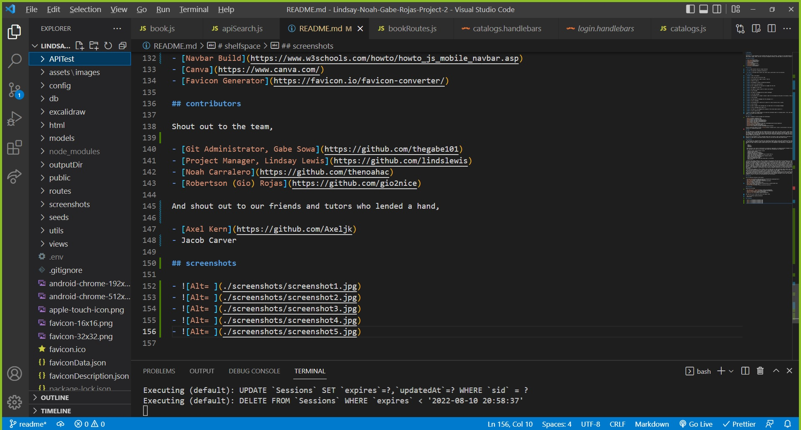
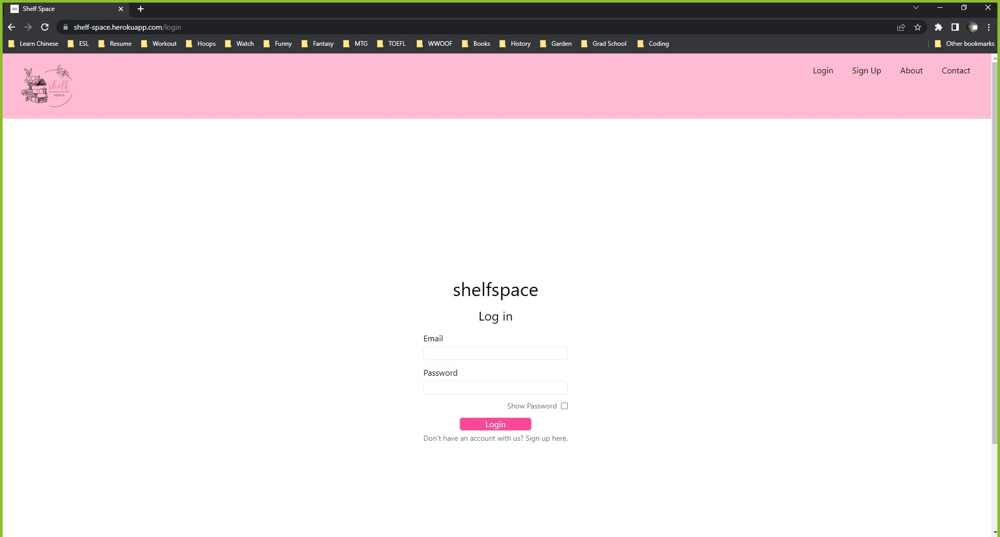
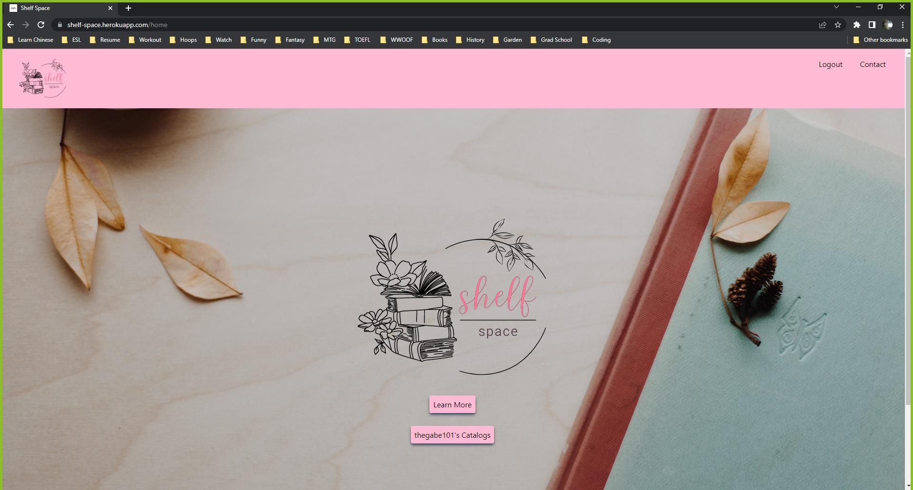
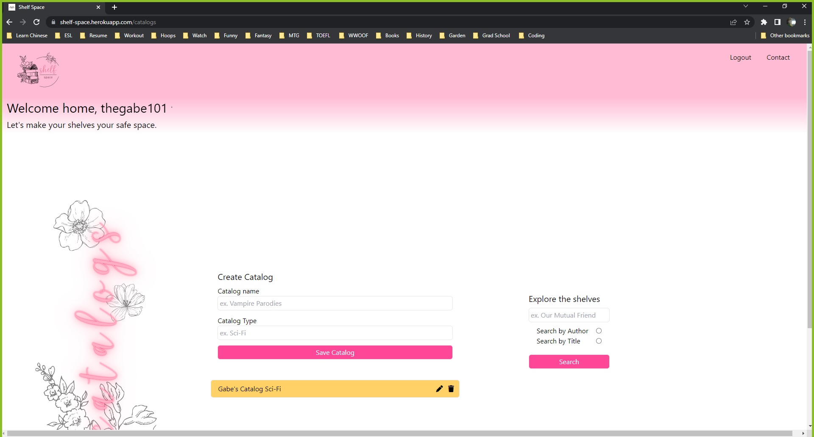
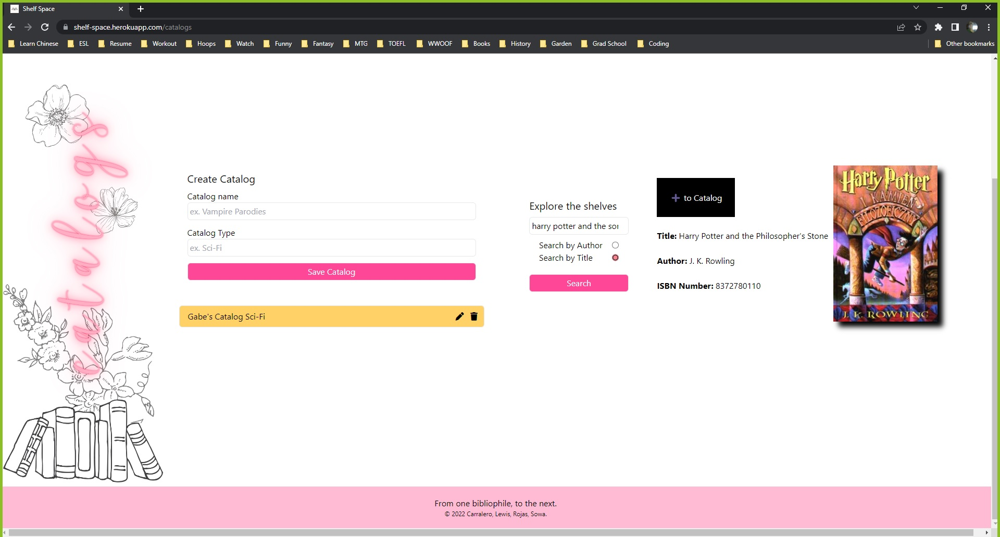

# shelfspace

## description

Shelfspace is an app designed for the ultimate book worm and avid collector, allowing for the simplification of cataloging their novels, manga, comics, and more. This app is deployed on Heroku, with many ideas in the oven for future improvements.

Check out Shelf Space [here](https://shelf-space.herokuapp.com/).

## table-of-contents

1. [user-story](#user-story)
2. [requirements](#requirements)
3. [composition](#composition)
4. [usage](#usage)
5. [reflections](#reflections)
6. [credits](#credits)
7. [contributors](#contributors)
8. [screenshots](#screenshots)

## user-story

> **AS A** book collector who has a large collection
>
> **I WANT** an app that I catalog my collection in
>
> **SO THAT** I can keep track of what I own, what I want, and be able to sort my collection.

## requirements

> **GIVEN** a URL to the website
>
> **WHEN** I visit the site for the first time
>
> **THEN** I am presented with a page to login or sign up
>
> **WHEN** I choose to sign up
>
> **THEN** I am prompted to create a username and password
>
> **WHEN** I click on the sign-up button
>
> **THEN** my user credentials are saved and I am logged into the site
>
> **WHEN** I am logged in to the site
>
> **THEN** I am taken to a page in which to create a user profile
>
> **WHEN** I click finished
>
> **THEN** I am taken to a homepage with my library catalogues
>
> **WHEN** I click add catalogue
>
> **THEN** I am presented with a prompt to choose a name for the catalogue and the genre of the books in the catalogue
>
> **WHEN** I click finished
>
> **THEN** I am taken back the homepage with the catalogues on it
>
> **WHEN** I click a catalogue
>
> **THEN** I am presented with a search bar to search for a book to add by title or author
>
> **WHEN** I click finished
>
> **THEN** my book is added to the catalogue and I am taken back to the catalogue homepage
>
> **WHEN** I click a catalogue with a book in it
>
> **THEN** I am taken to a new webpage with a display of the various books inside of it
>
> **WHEN** I click a specific book
>
> **THEN** I am taken to a modal display of the book and information about it including author, title, year published, and images of the author and the book cover

## composition

This app is composed of several packages and technologies:

- [Sequelize](https://sequelize.org/)
- [Tailwind](https://tailwindcss.com/)
- [DotENV](https://www.npmjs.com/package/dotenv)
- [Express](https://www.npmjs.com/package/express)
- [MySQL2](https://www.npmjs.com/package/mysql2)
- [Heroku](https://heroku.com/)
- [Connect Session Sequelize](https://www.npmjs.com/package/connect-session-sequelize)
- [Handlebars](https://handlebarsjs.com/)
- [bcrypt](https://www.npmjs.com/package/bcrypt)
- [Express Session](https://www.npmjs.com/package/express-session)
- [Animate.css](https://animate.style/)

It also involved the usage of the app, [Insomnia](https://insomnia.rest/), which is used outside of the users code editing software as a standalone application.

## usage

This web application is designed with the ultimate book worm in mind. Users can create a profile, create catalogs, and then begin to log the books that they own in their collection. Books can be stored in multiple catalogs, allowing users to sort through their collection based on their preferences and locate their books within the catalogs, this way they can avoid attempting to track down their physical copies without information beforehand, which is especially helpful to those who have rather large collections.

Users may also add comments to their individual books that are private to them, allowing them to look back at their thoughts on a book they've read without having to shout out into the void what they rated the book.

## reflections

- The motivation for creating this project was continuing to develop node.js skills that integrate vanilla javascript with the node runtime environment in order to build unique browser apps, generate individual data or files, and allow for dynamic user input. There are several primary tools new to us we integrated in this application, including but not limited to:

  - Node.js
  - Sequelize
  - Handlebars

  While we met our fair share of difficulties in building our application, we stayed motivated throughout to work through and comprehend code issues we were having. Said issues were including but not limited to:

  - Rendering things through template literal.
  - Linking scripts properly.
  - Rendering PNG files in handlebars.
  - Grabbing attribute data in handlebars.
  - Various CSS frameworks not working the way we wanted them to.
  - Logout route not working properly.
  - Session ids and login credentials being recogized properly.
  - Button linking via query selectors.
  - Difficulty integrating new NPM.
  - Model relationships and foreign keys being under or overstated.
  - and much more.

- We built this project largely in order to continue to get practice with the skills we are working on in class. Full-stack web development requires a massive amount of integration of various tools, concepts, mindstates; more than anything, this project required us to be mindful of how all of the tools we've been working with in class interlock. Furthermore, we have all begun to recognize that teamwork, even moreso than in other professional fields, is absolutely vital in a fullstack, team-based coding environment. While we built this project principally to use and learn more about the tools from class, it dawned on us rather rapidly how easy it was for us to break eachother's code, interfere with eachother's ambitions, and even have disagreements over who was doing what and how efficiently and effectively they were doing it. These interpersonal lessons may be just as vital to the whole experience of a group fullstack project as the tool lessons are themselves, in the long run- we all feel we learned a ton here on how to work with others in this sort of environment.
- This is a useful project in that it enables a user to keep track of a book collection tied to their user account. There are no special considerations or tools in the use of this project- one only needs a web browser. For a more detailed overview of the use of our website, please refer to usage section of this readme.
- This project represented an incredible jump in difficulty and learning curve that we were proud to tackle. We may not have overcome every hurdle we faced, but we overcame many. It was endlessly fascinating for us to learn, especially, how integrated front and back end are and the coordination they require between developers. We all feel infinitely more prepared for what is to come in our code adventures after this project.

## resources

List of resources utilized in this project:

- [Carnegie Museums](http://web-accessibility.carnegiemuseums.org/design/color/)
- [Font Awesome](https://fontawesome.com/icons)
- [Open Library](https://openlibrary.org/dev/docs/api/books)
- [Unsplash](https://unsplash.com/)
- [W3 Schools](https://www.w3schools.com/)
- [Navbar Build](https://www.w3schools.com/howto/howto_js_mobile_navbar.asp)
- [Canva](https://www.canva.com/)
- [Favicon Generator](https://favicon.io/favicon-converter/)

## contributors

Shout out to the team,

- [Git Administrator, Gabe Sowa](https://github.com/thegabe101)
- [Project Manager, Lindsay Lewis](https://github.com/lindslewis)
- [Noah Carralero](https://github.com/thenoahac)
- [Robertson (Gio) Rojas](https://github.com/gio2nice)

And shout out to our friends and tutors who lended a hand,

- [Axel Kern](https://github.com/Axeljk)
- Jacob Carver

## screenshots

- 
- 
- 
- 
- 
